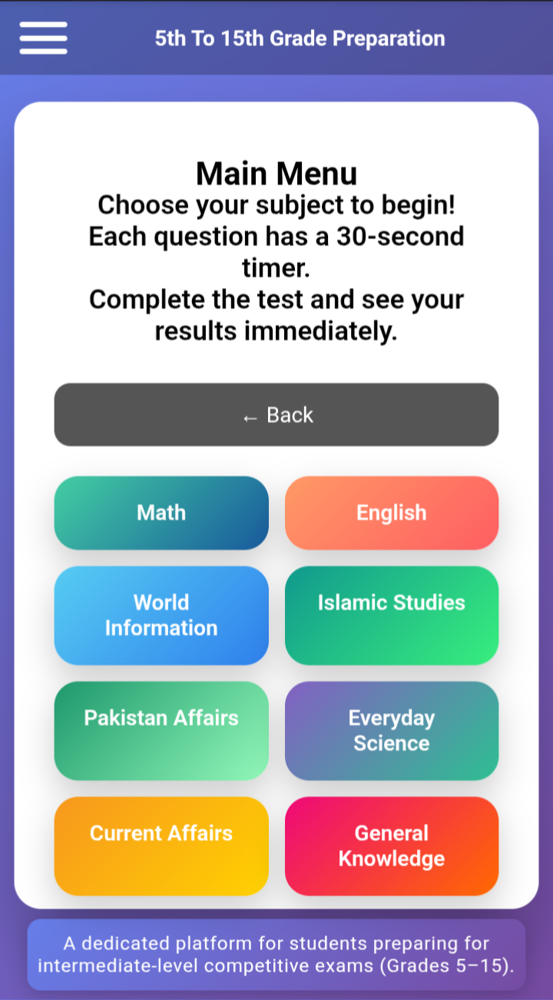
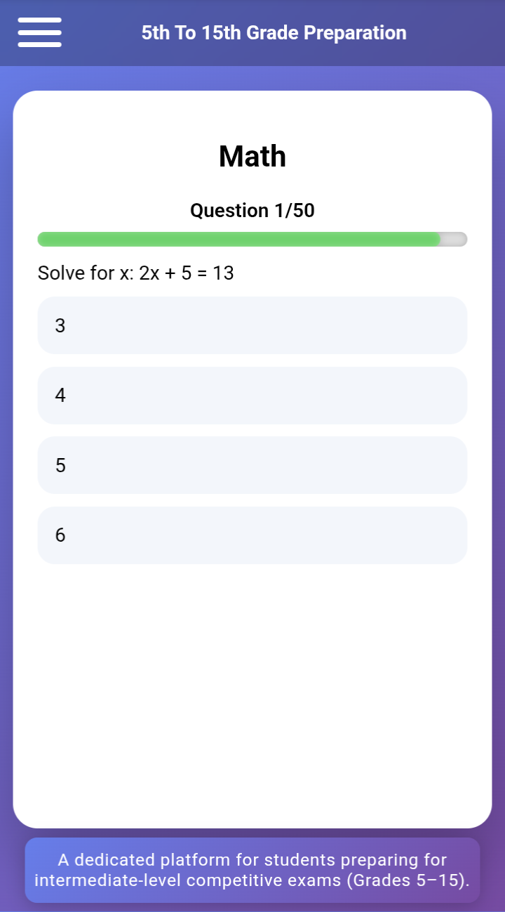
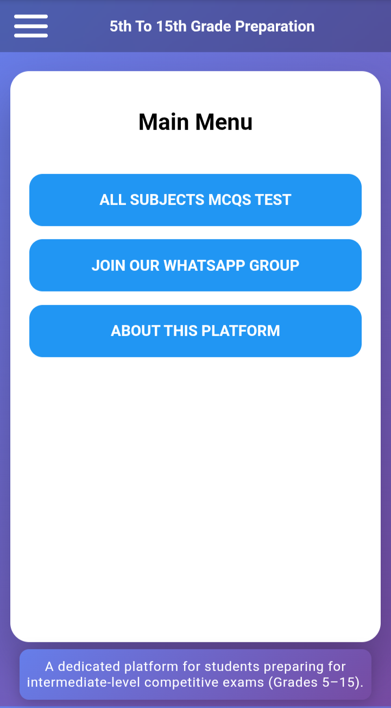
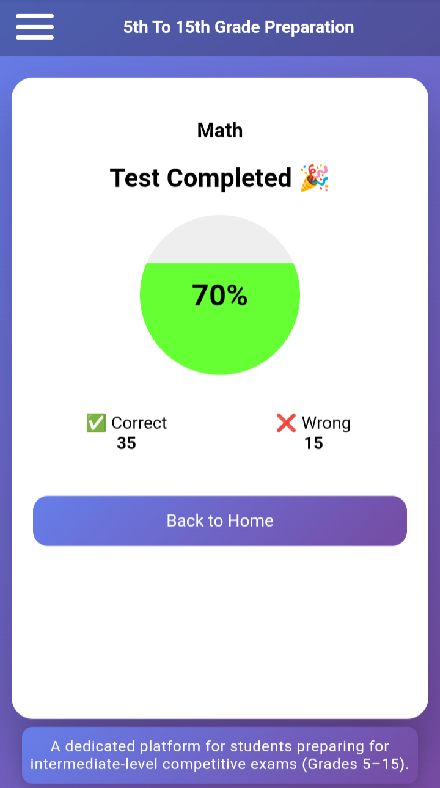

## 🎓 5 To 15 Preparation Program

<p align="center">
  
  
  
  
  
</p>

<p align="center">
  <b>A complete exam preparation platform for students from 5th to 15th grade</b><br/>
  Learn smarter • Practice better • Score higher
</p>

---

## 🌐 Live Demo
🔗 **https://rehanalitalpur108-cmyk.github.io/5-To-15-Preparation-Program/**

---

## 📌 About the Project

**5 To 15 Preparation Program** is a modern, lightweight, and student-focused exam preparation platform.  
It provides **all subjects MCQs, practice tests, and learning material** in a single, easy-to-use interface.

The project is designed to help students:
- Build strong concepts  
- Practice real exam-style questions  
- Improve confidence and performance  

---

## ✨ Key Features
- 📚 All Subjects MCQs Tests  
- 📝 Practice Tests for Self-Assessment  
- 📱 Fully Responsive (Mobile & Desktop)  
- ⚡ Fast, Lightweight & Offline-Friendly  
- 🔄 Regular Updates Based on User Feedback  
- 🎯 Simple UI for Distraction-Free Learning  

---

## 📸 Screenshots

<p align="center">
  
  
</p>

<p align="center">
  
  
</p>

---

## 🛠️ Tech Stack
- **HTML5**  
- **CSS3**  
- **JavaScript (Vanilla)**  

_No frameworks. No dependencies. Clean & beginner-friendly._

---

## 🚀 Getting Started

### Clone the repository
```bash
git clone https://github.com/rehanalitalpur108-cmyk/5-To-15-Preparation-Program.git
